# Hatari: agentic development fork

This is a fork of [Hatari](https://www.hatari-emu.org/), the Atari
ST/STE/TT/Falcon emulator. It adds an **HTTP/JSON control API** so that AI
agents and automated tools can drive the emulator end to end: boot any TOS,
type and click, read the screen at native resolution, capture program text
output, save and restore snapshots, and stop, step and inspect the 68k CPU.
It also includes a **GDB remote stub**, so any m68k GDB or IDE can debug
code running in the emulator.

For the original Hatari documentation see [readme.txt](readme.txt) and
[doc/](doc/).

## Quick start (macOS / Linux)

```sh
# build
mkdir -p build && cd build
cmake .. -DCMAKE_OSX_ARCHITECTURES=arm64   # macOS + Homebrew; omit on Linux
cmake --build . -j$(getconf _NPROCESSORS_ONLN)
cd ..

# free EmuTOS ROMs (58 images: ST/STE/TT/Falcon, 19 languages) into roms/
tools/agent/fetch-emutos.sh

# start Hatari with the agent API on http://127.0.0.1:7777/
tools/agent/hatari-agent-run.sh --machine ste --conout 2

curl -s localhost:7777/status
curl -s -o screen.png localhost:7777/screen
curl -s -XPOST 'localhost:7777/input/click?x=82&y=4'
curl -s -XPOST localhost:7777/input/type --data-binary $'hello\n'
curl -s -XPOST localhost:7777/debug/break
```

## What you can do

| Area | Endpoints |
|---|---|
| Emulation | pause / resume / run exactly N frames / reset / fast forward / quit / any Hatari option |
| ROMs and media | list and boot TOS images (EmuTOS or your own), floppy images, host folder as drive C:, autostart a program |
| Screen | PNG at native emulated resolution (coordinates = mouse coordinates) |
| Input | type text, key combos, absolute or relative mouse, clicks, joystick |
| Memory and CPU | read/write memory, registers, disassembly |
| Debugger | break, step, step over, breakpoints (address or conditional), wait for stop, any Hatari debugger command with captured output |
| State | save/restore full snapshots, read program console output as text |
| GDB | `--gdb-port 2159`: registers, memory, stepi, breakpoints, watchpoints, Ctrl-C, `monitor` = Hatari debugger |

* API reference: [doc/agent-api.md](doc/agent-api.md)
* GDB: [doc/agent-gdb.md](doc/agent-gdb.md) (`gdb -x tools/agent/hatari.gdb`)
* Design and changes to Hatari: [doc/agent-design.md](doc/agent-design.md)
* Claude Code skill: [.claude/skills/hatari-agent/SKILL.md](.claude/skills/hatari-agent/SKILL.md)
* Python client and GUI: `tools/agent/hatari_agent.py`, `python3 tools/agent/hatari_gui.py`

## Examples

* [examples/gemdemo](examples/gemdemo): a GEM VDI showcase written in C, cross-compiled with m68k-atari-mintelf GCC
* [examples/interact](examples/interact): a GEM test target app, shell tests for every API feature,
  Python scenarios and the GUI
* Amiga game ports from [geekychris/amiga_games](https://github.com/geekychris/amiga_games), made
  and tuned with the agent API (profiler, breakpoints, `/mem`, scripted play). To pick one and
  play it, run `python3 tools/games/launcher.py`: a game menu driven by
  [examples/games.ini](examples/games.ini), see [tools/games](tools/games). Or put them all on
  one Atari C: drive with a menu that runs on the ST itself:
  [examples/st_launcher](examples/st_launcher) (`make play`).
  * Atari ST ([examples/st_port](examples/st_port) layer):
    [uranus_lander](examples/uranus_lander) (with an autopilot),
    [nova_defense](examples/nova_defense) (with a bot),
    [frank_the_frog](examples/frank_the_frog)
  * Atari STE (same layer, plus Paula emulation on DMA sound and a C ProTracker player):
    [rock_blaster](examples/rock_blaster), [orbital_patrol](examples/orbital_patrol) (MOD music),
    [jump_quest](examples/jump_quest), [stakattack](examples/stakattack) (MOD music),
    [dot_chase](examples/dot_chase), [lunar_rider](examples/lunar_rider) and
    [pea_shooter_blast](examples/pea_shooter_blast) (both scrolled with the STE blitter)
  * Atari Falcon030 ([examples/falcon_port](examples/falcon_port) layer: true colour, Paula on
    DMA sound): [fractalus](examples/fractalus) (voxel terrain, with a rescue scenario test),
    [void_trader](examples/void_trader) (filled 3D, trading)

<table><tr>
<td align="center">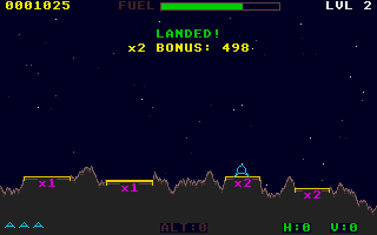<br>Uranus Lander (ST)</td>
<td align="center">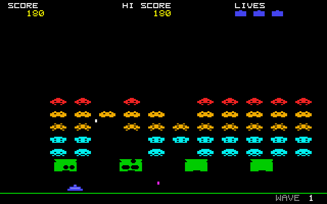<br>Nova Defense (ST)</td>
<td align="center">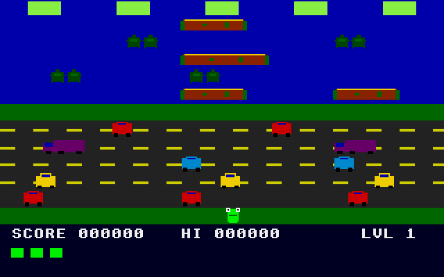<br>Frank the Frog (ST)</td>
<td align="center"><br>Fractalus (Falcon030)</td>
</tr><tr>
<td align="center">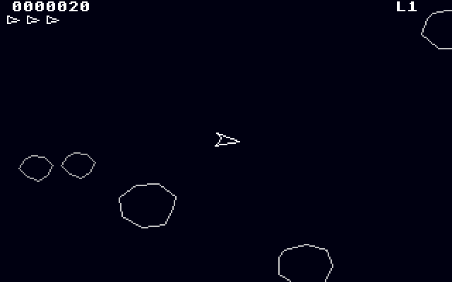<br>Rock Blaster (STE)</td>
<td align="center">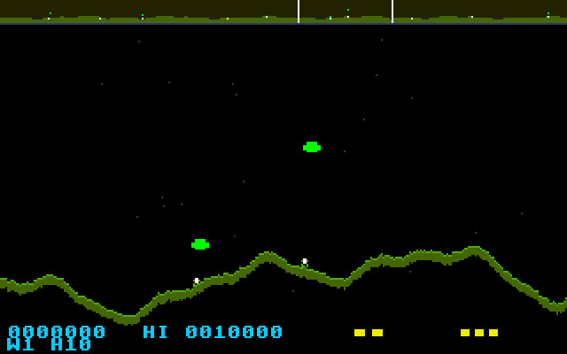<br>Orbital Patrol (STE)</td>
<td align="center">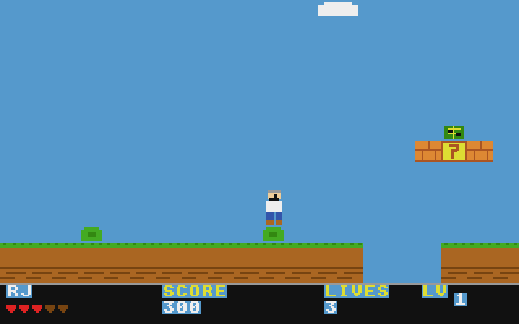<br>Jump Quest (STE)</td>
<td align="center">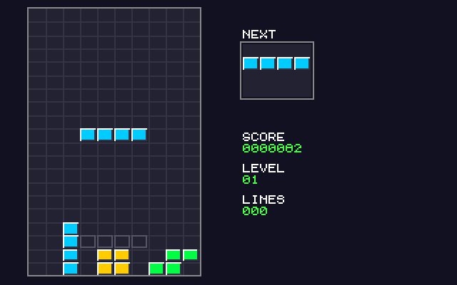<br>StakAttack (STE)</td>
</tr><tr>
<td align="center">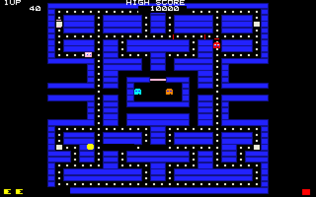<br>Dot Chase (STE)</td>
<td align="center">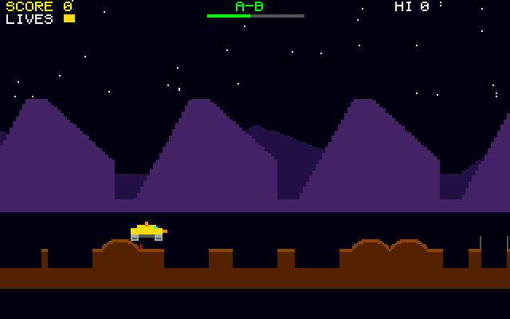<br>Lunar Rider (STE)</td>
<td align="center">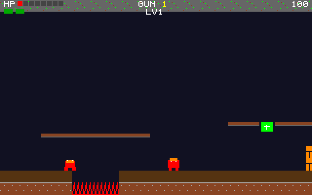<br>Pea Shooter Blast (STE)</td>
<td align="center">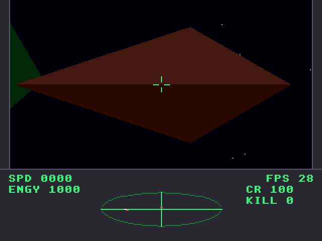<br>Void Trader (Falcon030)</td>
</tr></table>

## ROMs

Only the free [EmuTOS](https://emutos.sourceforge.io/) images are fetched.
Original Atari TOS images are copyrighted. If you own them, copy them into
`roms/` (git-ignored) and `GET /roms` lists them alongside EmuTOS.

## License

GPL v2 or later, like Hatari. See [gpl.txt](gpl.txt).
