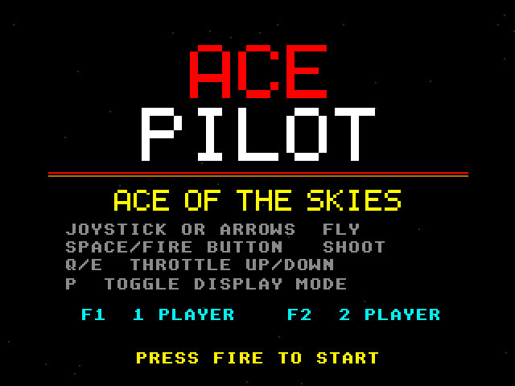
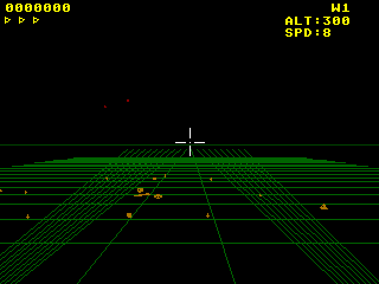
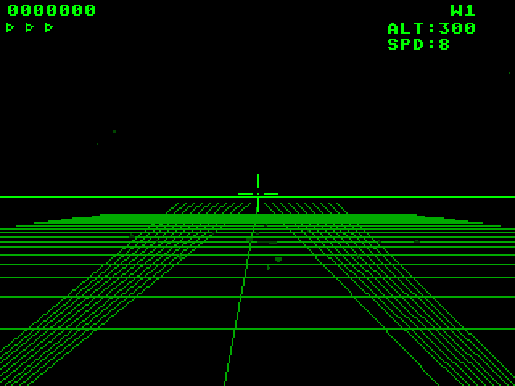

# Ace Pilot: Atari Falcon030 port

Port of Ace Pilot, the 3D wireframe biplane dogfighting game in
[geekychris/amiga_games](https://github.com/geekychris/amiga_games) (`ace_pilot/`,
commit in `.upstream-commit`). It runs on the Falcon layer in `../falcon_port`, with the Paula emulation and C ptplayer from `../st_port`.

## Screenshots

<table><tr>
<td align="center"><br>Title</td>
<td align="center"><br>Colour display mode</td>
<td align="center"><br>Classic green vectors (P on the title)</td>
</tr></table>

Captured through the agent API (`/screen`, 2x).

```sh
make CROSS=~/computers/atari-cc/opt/cross-mint/bin/m68k-atari-mintelf-
make run CROSS=...      # Falcon030, 14 MB, VGA (copies the MOD as BLUE_DAN.MOD)
```

Controls, as on the Amiga:
- Cursor keys, WASD or joystick 1: fly.
- Space, Alt or fire: shoot.
- Q/E: throttle up/down.
- On the title: P toggles the display mode (colour or classic green); F1 picks one player and F2 two (player 2 flies with joystick 0, the mouse port, in a split screen); fire starts.
- Esc returns to the title; Esc there quits.

## Why the Falcon

I ported it to the STE first. The original redraws about 200 lines a frame, and on every game step each of the up to 8 enemies searches for its aiming angle with 142 32-bit multiplies. The 68000 has no 32-bit multiply, so each one is a library call. Even with OR-mode lines, `movem` clears and 16-bit multiplies, an 8 MHz STE managed about 2 frames a second, and the game ran in slow motion.

The Falcon030 multiplies in one instruction, and its chunky true-colour screen makes a line a run of word writes. So this port runs the original code **unmodified**.

## What changed

| | |
|---|---|
| `game.c`, `engine3d.c`, `models.c`, `render.c`, `sound.c`, all headers except `sound.h` | **Unmodified.** |
| `sound.h` | Under `__MINT__`, `CUSTOM_BASE` points at the Paula emulation instead of `$DFF000`. |
| `main_falcon.c` | Replaces `main.c` (kept as `main.c.amiga`): the palette, the state machine and the rendering calls, with the Falcon's screen (`fgfx`), input and timing. The MOD (Strauss's Blue Danube, generated by `gen_mod.py`) and the sound effects play on the C ptplayer on Falcon DMA sound. |
| `st_input.c` | The same keys from the IKBD handler; joystick 1 for player 1 and joystick 0 for player 2. For that, `../st_port/st_ikbd` now also decodes joystick 0 (`ikbd_joy0()`). |

### Timing

On the Amiga the game advances one step per 50 Hz frame. The port runs the steps at a fixed 50 Hz, up to 6 per displayed frame, so the game keeps the Amiga's speed at the Falcon's frame rate.

## Performance

**About 10–11 fps on a 16 MHz Falcon030** (VGA, 320×240 true colour), with game logic at 50 Hz. Clearing the screen each frame takes about a fifth of the frame, limited by the Falcon's 16-bit bus. Lines take another fifth.

## Agent hooks

The game logs `ACEP SYMBOL ...` lines with addresses for `world`, `players`, `g_tune` (the Amiga version's bridge tunables: difficulty, display mode, god mode...), `game_state` and `frame_sync`. It also logs `ACEP STATE`, `ACEP SCORE` and `ACEP PERF` events.
