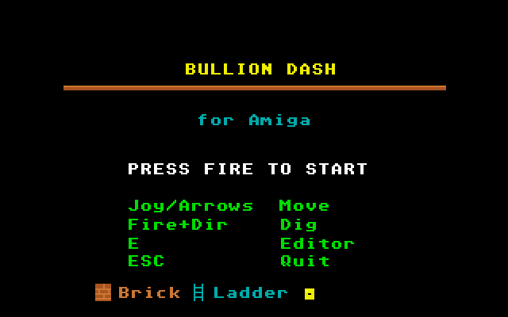
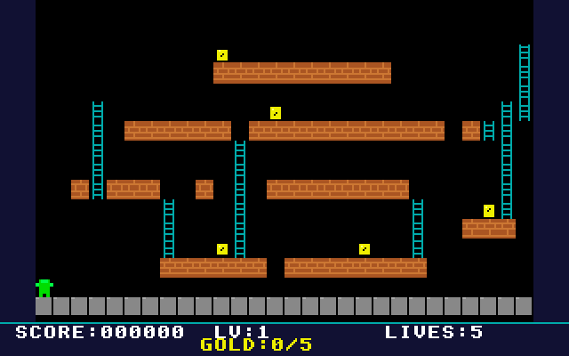
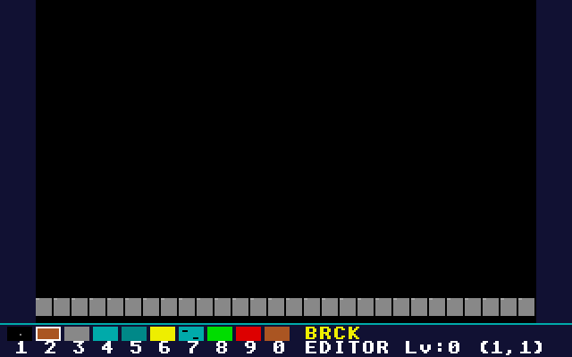

# Bullion Dash: Atari STE port

Port of Bullion Dash, the Lode Runner-style puzzle platformer with a level editor, from
[geekychris/amiga_games](https://github.com/geekychris/amiga_games) (`bullion_dash/`,
commit in `.upstream-commit`), built on the shared ST layer in `../st_port`.

## Screenshots

<table><tr>
<td align="center"><br>Title</td>
<td align="center"><br>Level 1</td>
<td align="center"><br>Level editor</td>
</tr></table>

Captured through the agent API (`/screen`, 2x).

```sh
make CROSS=~/computers/atari-cc/opt/cross-mint/bin/m68k-atari-mintelf-
make run CROSS=...      # STE, EmuTOS 1024k, autostart
```

Controls, as on the Amiga:
- Cursor keys or joystick: run and climb.
- Space, Return or fire with left or right: dig.
- Fire: start.
- E on the title: level editor (digits pick a tile, fire places it, F1–F3 are the editor's file and level keys).
- Esc: quit.

Collect all the gold, then climb out at the top.

## What changed

| | |
|---|---|
| `player.c`, `enemy.c`, `level.c`, `editor.c`, `sound.c`, all headers | **Unmodified.** Levels saved and loaded by the editor go through the AmigaDOS shim, as 8.3 files in the program's directory. |
| `modplay.c` | The game's own music player, which drives Paula directly. One `ST port:` block skips its two dummy CIA reads, which are a bus error on the ST. It is built as C++ (`modplay_st.cpp`) so its `dmacon` writes reach the Paula emulation, and plays on STE DMA sound at 6258 Hz. |
| `render.c` | One `ST port:` block: `render_st_tile`, the same tile drawing as `render_playfield`, for a single tile. |
| `main_st.c` | `main.c`'s loop (kept as `main.c.amiga`, its screen code as `gfx.c.amiga`). Each 50 Hz VBL runs one game step and one music tick, as on the Amiga; the drawing happens once per frame. |
| `st_input.c` | `input.c`'s API (held directions, edge-detected fire and keys) on the IKBD handler. `input_key()` takes the game's Amiga raw key codes and maps them to ST scancodes; presses are latched so short ones aren't lost. |

### Rendering

The Amiga version clears and redraws the whole playfield every frame. The port uses the ST layer's layers:
- **Playfield:** scenery, drawn in full once per level. After that only the tiles that change are redrawn: bricks dug and refilled, gold taken, ladders revealed. They're found by comparing with a copy of the tile grid, and only their rows are copied to the screens.
- **Status bar and overlays:** the HUD layer, which renders what changed.
- **Player and enemies:** the back buffer, undone through dirty rectangles.
- **Editor:** redraws the whole back buffer itself.

## Performance

**About 25 fps on an 8 MHz STE** (200–210 VBLs per 100 frames), with game logic at 50 Hz. A fifth of the CPU goes to mixing the four-channel music.

## Agent hooks

The game logs `BULL SYMBOL ...` lines with addresses for `gs`, `player` (`gx`, `gy`, `px`, `py`, `dir`, `state` as 32-bit ints), `tiles` (28 × 16 bytes, column-major), `state` and `frame_sync`. It also logs `BULL STATE`, `BULL SCORE` and `BULL PERF` events.

Note for scripted play: hold keys with `/input/key?action=down` and `action=up`. A short `frames=` press is enough for fire, but not to keep running.
