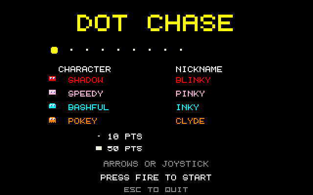

# Dot Chase: Atari STE port

Port of Dot Chase, the maze dot-eater in
[geekychris/amiga_games](https://github.com/geekychris/amiga_games) (`dot_chase/`,
commit in `.upstream-commit`), built on the shared ST layer in `../st_port`.

## Screenshots

<table><tr>
<td align="center"><br>Title</td>
<td align="center"><br>Play</td>
</tr></table>

Captured through the agent API (`/screen`, 2x).

```sh
make CROSS=~/computers/atari-cc/opt/cross-mint/bin/m68k-atari-mintelf-
make run CROSS=...      # STE, EmuTOS 1024k, autostart
```

Controls, as on the Amiga:
- Cursor keys, WASD or joystick: move.
- Space, Return or fire: start.
- Esc: quit.

## What changed

| | |
|---|---|
| `game.c`, headers | **Unmodified.** |
| `sound.c` | It drives the Paula registers directly. One `ST port:` define points it at the Paula emulation instead of `$DFF000`, and it is built as C++ (`sound_st.cpp`) so its `dmacon` writes reach the emulated DMA control. It plays on STE DMA sound. |
| `draw.c` | Original drawing code, with `ST port:` changes listed below. |
| `main_st.c` | `main.c`'s loop (kept as `main.c.amiga`), with game updates and sound handling once per 50 Hz VBL, and drawing once per frame. |
| `st_input.c` | The same key map, from the IKBD handler and joystick 1; the start key is latched so short presses count. |

### ST port changes in `draw.c`

Like the Amiga version, `draw.c` draws the maze once per buffer, then each frame restores only the tiles under the moving sprites. Restoring them from rectangles, about 500 `RectFill`s per frame, is too slow on a 68000, so:
- **Maze copy:** the maze is also kept in the ST layer's scenery buffer, drawn by the same code. A tile whose content changed (a dot eaten) is redrawn there first, then the area under a sprite is copied from it.
- **Text:** title and game-over strings are cached operations on the HUD layer.

## Performance

**25 fps on an 8 MHz STE**, with game logic at 50 Hz.

## Agent hooks

The game logs `DOTS SYMBOL ...` lines with addresses for `gs`, `maze`, `muncher` and `ghosts`, plus `DOTS STATE`, `DOTS SCORE` and `DOTS PERF` events.
