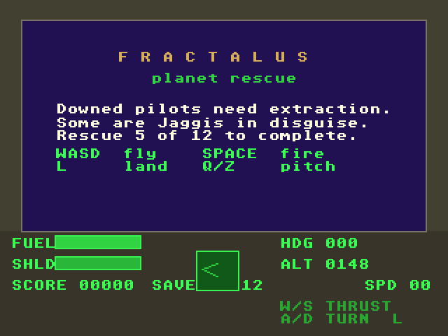
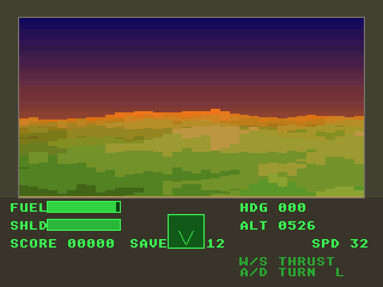
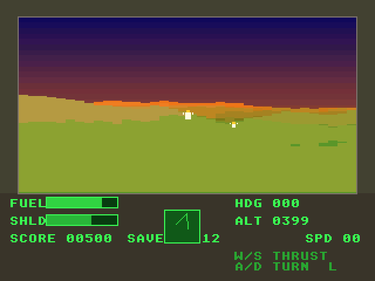
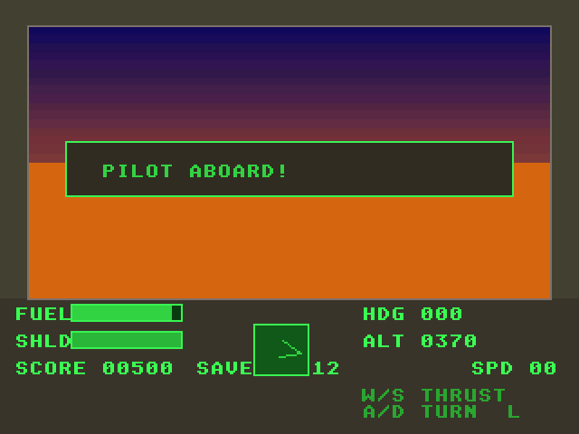
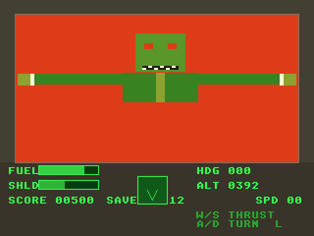

# Fractalus: Atari Falcon030 port

Port of the Rescue on Fractalus homage from
[geekychris/amiga_games](https://github.com/geekychris/amiga_games) (`fractalus/`,
commit in `.upstream-commit`). The original targets AGA (320x256, 256
colours, 68020), so this port targets the **Falcon030**: 16 MHz 68030,
320x240 in 16-bit true colour. It uses the shared Falcon layer in
`../falcon_port`.

## Screenshots

<table><tr>
<td align="center"><br>Title and briefing</td>
<td align="center"><br>Flying over the fractal terrain</td>
<td align="center"><br>Downed pilots in view</td>
</tr><tr>
<td align="center"><br>Pilot aboard</td>
<td align="center"><br>A Jaggi in disguise</td>
</tr></table>

Captured through the agent API (`/screen`, 2x). The rescue and Jaggi shots come from `rescue_test.py`.

```sh
make CROSS=~/computers/atari-cc/opt/cross-mint/bin/m68k-atari-mintelf-
make run CROSS=...      # Falcon, 14 MB, VGA, EmuTOS 1024k, autostart
./rescue_test.py        # scenario test through the agent API (see below)
```

Controls are the same as on the Amiga:
- A/D or ←/→: turn
- W/↑: thrust
- S/↓: brake
- Q/Z: pitch
- Space: fire / start
- Return: restart after a win or loss
- L: land
- Esc: quit

The joystick also works: directions turn, thrust and brake, and fire fires.

## What changed

| | |
|---|---|
| `terrain.cpp`, `game.cpp`, `pilots.cpp`, `combat.cpp`, `sfx.cpp`, all headers | **Unmodified.** They compile against the Amiga header shims in `../falcon_port/compat`. |
| `modplay.c` | **Unmodified.** The original Paula MOD player and track generator. It is compiled as C++ so its `custom.dmacon` writes reach the Paula emulation (`fpaula`), with its entry points renamed `mp_*_raw` (Makefile). |
| `render.cpp` | Original renderer. `__MINT__` branches add the true-colour fill primitives, display open/flip, the palette into an RGB565 table, and the fast terrain path (below). |
| `main_falcon.cpp` | The original `main.cpp` (kept as `main.cpp.amiga`) with the AmigaOS parts (libraries, IDCMP, singleton port, DateStamp) replaced by IKBD input, the VBL counter and NatFeats logging. The game loop body (attract / title / restart logic) is copied verbatim. |
| `march_falcon.c` | The terrain column renderer in 68030 assembly. |
| `audio_falcon.cpp` | Runs the player from the VBL interrupt at its design rate of 50 Hz, and wraps the game's calls with interrupts masked. |

## Performance

All numbers were measured with the agent API on Hatari's cycle-exact
Falcon (`profile on`, `hatari_profile.py`). The voxel terrain is the
cost: 36 columns × ~130 samples per column, with a bilinear height
sample and a projection divide for each.

| Step | Frame rate |
|---|---|
| Straight port | 2.6 fps |
| Tables for the per-sample constants, inlined height sample | 3.7 fps |
| March loop in asm, fitting the 030's 256-byte i-cache | 4.2 fps |
| March in runs of equal step; sky painted per column only above terrain; no VBL wait | 5.5 fps |
| Column fill moved into the asm loop; triple buffering | **8.8 fps** |
| With music + SFX mixing (≈10% CPU) | **7.9 fps** |

The first three rows were measured on the title screen, which renders the
terrain under the briefing panel. The rest were measured in flight.

Details of the fast path:
- The distance sequence is identical for every column. PROJ/dist (a 12-bit
  reciprocal with the same truncation toward zero), the fog bin and the runs
  of equal step are tables built once.
- The ray advances by `rdx*step`, which equals `rdx*dist`.
- Heights come from a padded copy with 256-byte rows, so no wrap masking is
  needed.
- The output matches the original except for an occasional 1-pixel rounding
  difference in the projection.

The C version of the inner loop compiled to ~360 bytes. That is more than
the 030's instruction cache, so every sample refetched its code from ST RAM,
which the true-colour video DMA keeps busy. Fitting the loop into the cache
mattered more than counting instructions.

The game ticks at 30 Hz regardless of frame rate (up to 4 ticks per
rendered frame), because the Amiga version was tuned for about 30 fps.

## Sound

Paula is emulated on the Falcon's DMA sound (`../falcon_port/fpaula`):
- Four channels are mixed Amiga-style (0+3 left, 1+2 right) into an 8-bit
  stereo ring buffer at 9834 Hz, from the VBL interrupt.
- The mixer uses a volume table and add/addx stepping, with a fast path for
  the silence blocks that one-shot samples end on.

Both songs and all four sound effects play. `tools/agent/dma_sound_capture.py
out.wav 5` records the DMA sound through the agent API.

## Agent hooks

- **Addresses.** At start-up the game logs `FRACTALUS S <name> 0x<addr>` lines
  (`g_state`, `pilots`, `pilots_rescued`, `rescue_state`, `mode`,
  `bench_mask`, `frame_sync`) on `/console`.
- **Heartbeat.** About every 50 frames it logs `FRACTALUS I hb: ...` with fps,
  mode, rescue state, shield, fuel and score. `AB_I` lines from the original
  code arrive as `FRACTALUS I ...`.
- **`rescue_test.py`.**
  - Starts a mission, then teleports the ship onto the nearest human pilot by
    writing `ship.x/z` through `/mem`, and lands (L).
  - Follows the rescue state machine (LANDING → AIRLOCK → REVEAL → TAKEOFF)
    and checks that `pilots_rescued` went up.
  - Repeats with a Jaggi (AIRLOCK → JUMPSCARE) and checks that it did not.
  - Saves a screenshot of each state.
- **`bench_mask`.** This is the original's render-phase switch (see
  `render.cpp`) and can be poked through `/mem` for A/B timing.

## Notes

- **No FPU needed.** The game code is built `-m68030 -msoft-float`, but
  linked against the 68000 libraries. mintlib's `m68020-60` multilib
  requires a 68881/2, which most Falcons don't have.
- **RGB/TV monitors are untested.** They use 320x200 (`fgfx` picks the mode
  from `VgetMonitor()`); only VGA (320x240) was tested.
- **Radar box covers the "SAVED" text.** The radar box is drawn over part of
  "SAVED n/12" in the original too.
- **Host audio hang.** If Hatari hangs at start-up inside macOS CoreAudio (a
  host audio problem seen during this work), run
  `make run HATARI_OPTS="--sound off"`. DMA sound is still emulated, and the
  capture tool still works.
