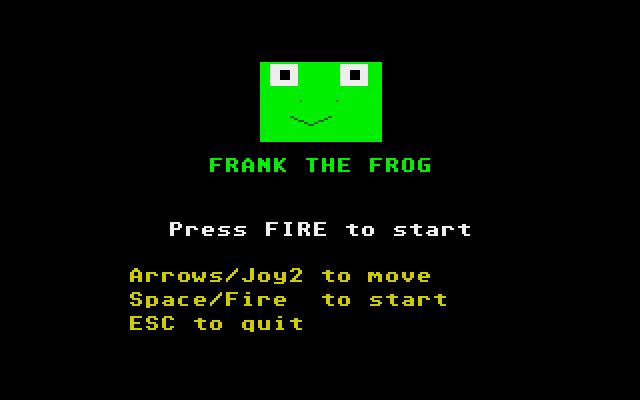

# Frank the Frog: Atari ST port

Port of Frank the Frog from
[geekychris/amiga_games](https://github.com/geekychris/amiga_games) (`frank_the_frog/`,
commit in `.upstream-commit`), built on the shared ST layer in `../st_port`.

## Screenshots

<table><tr>
<td align="center"><br>Title</td>
<td align="center"><br>Road, river and homes</td>
</tr></table>

Captured through the agent API (`/screen`, 2x).

```sh
make CROSS=~/computers/atari-cc/opt/cross-mint/bin/m68k-atari-mintelf-
make run CROSS=...
```

Controls: cursor keys or joystick to hop. Space/Return/fire to start. M
toggles music. Esc quits.

## What changed

| | |
|---|---|
| `frank.c`, `playfield.c`, `score.c` | **Unmodified.** They compile against the Amiga header shims in `../st_port/compat` (`exec/types.h`, `graphics/rastport.h`, `proto/graphics.h` → `st_gfx`). |
| `lanes.c` | Unmodified logic. Under `__MINT__`: lane objects are drawn from a cache of pre-shifted sprites built by the original draw functions. Logs/turtles are pre-composited onto water (opaque copies). Home frogs are drawn separately. |
| `main_st.c` | The original `main.c` state machine and title/overlay drawing, with ST input (latched key/joystick presses), layered rendering and NatFeats `FROG` events. |
| `st_modplay.c` | The original generated heavy-metal track: pattern generator and song order copied verbatim, replayed on the YM2149 (guitar → A, bass → B, drums → C; the harmony channel is dropped). |
| `st_sound.c` | Hop/splat/splash/home/level/game-over effects synthesised on YM channel C, interrupting the drums like the Amiga version steals Paula channel 3. |

## Performance

On a plain 8 MHz ST, redrawing ~26 moving lane objects per frame is bound
by bus read-modify-write cycles (measured with the agent API: cycle-exact
frame timing, profiler, `perf_flags` A/B tests). A 16 MHz Mega STE runs it
no faster because its bus is still 8 MHz. The display runs a steady
**16.7 fps with three 50 Hz game updates per frame**, so the game plays at
the Amiga's speed. The STE blitter would be the way to 50 fps.
