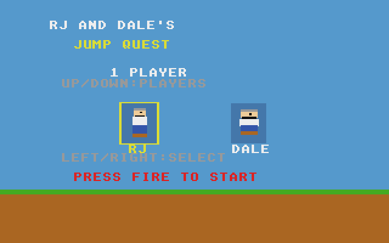
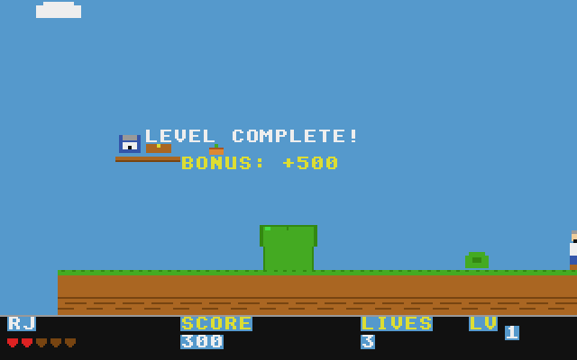
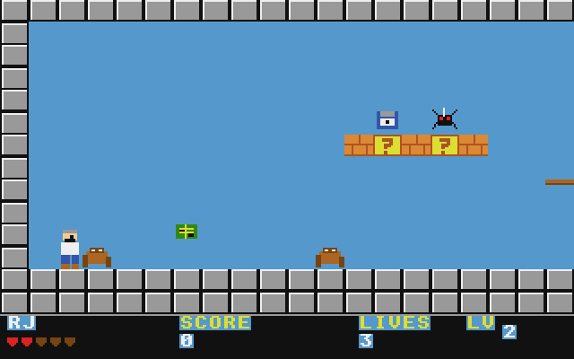

# Jump Quest: Atari STE port

Port of RJ and Dale's Jump Quest, the platformer in
[geekychris/amiga_games](https://github.com/geekychris/amiga_games) (`jump_quest/`,
commit in `.upstream-commit`), built on the shared ST layer in `../st_port`.

## Screenshots

<table><tr>
<td align="center"><br>Title and character select</td>
<td align="center"><br>Level 1: Office Park</td>
</tr><tr>
<td align="center"><br>Level complete</td>
<td align="center"><br>Level 2: Server Room</td>
</tr></table>

Captured through the agent API (`/screen`, 2x). The level 2 shot was reached by writing the player's x position through `/mem`.

```sh
make CROSS=~/computers/atari-cc/opt/cross-mint/bin/m68k-atari-mintelf-
make run CROSS=...      # STE, EmuTOS 1024k, autostart
```

Controls, as on the Amiga:
- Cursor keys, WASD or joystick: move.
- Space, Alt, Z, X or fire: jump.
- Return: start.
- Esc: quit.
- On the title screen, left/right picks RJ or Dale and up/down picks 1 or 2 players.

## What changed

| | |
|---|---|
| `player.c`, `enemy.c`, `items.c`, `hud.c`, `title.c`, `levels/*.h` | **Unmodified.** |
| `game.h` | Under `__MINT__`, the game's `gfx_init`/`gfx_swap`/`gfx_cleanup`/`gfx_backbuffer` are renamed `jq_*`, because the ST layer uses those names. The declarations get C linkage for `sound.c`, which is built as C++. |
| `gfx.c` | Screen setup replaced by thin wrappers over the ST layer. `gfx_draw_tile` is unchanged. |
| `level.c` | `level_draw` uses a tile cache (below); `level_get_tile` uses a 16-bit multiply. |
| `sound.c` | The chiptune and the effects drive the Paula registers directly. Under `__MINT__` those point at the Paula emulation, which plays on STE DMA sound at 6258 Hz. |
| `main_st.c` | Replaces `main.c` (kept as `main.c.amiga`). The particle code and the level, camera and end-check helpers are copied verbatim. The state machine is split into a 50 Hz logic step and a per-frame draw. |
| `st_input.c` | The same key map, from the IKBD handler and joystick 1. |

### Rendering

The Amiga version redraws the whole playfield, about 280 tiles of rectangles and lines, every frame, which an 8 MHz 68000 can't do. The camera only moves in whole 16-pixel tiles, so tiles always land on word boundaries in ST low resolution:
- **Tile cache:** each tile type is drawn once, by the original `gfx_draw_tile`, into a cache of plane words.
- **Scenery:** the visible tiles are copied into the scenery buffer only when the camera steps or a `?` block is hit. Each screen then gets the new playfield once.
- **Every frame:** sprites are drawn and undone through dirty rectangles. The HUD is in the HUD layer.

### Deviation from the original

`sound.c` starts each sound effect but never stops it. On the Amiga, Paula repeats a sample until its DMA is turned off, so every effect keeps looping as a buzz until the next one. The port plays each effect once: an `ST port:` change points the channel at a silent block after the effect, as one-shot samples normally do.

## Performance

The game runs at **25–29 fps on an 8 MHz STE**, with game logic at 50 Hz. Most of that comes from:
- the tile cache and dirty rectangles;
- the Paula mixer's loop mode for short looping waveforms;
- 16-bit tile lookups.

## Agent hooks

The game logs `JQUEST SYMBOL ...` lines with addresses for `game`, `player`, `state`, `cam_x` and `frame_sync`. It also logs `JQUEST STATE`, `JQUEST SCORE` and `JQUEST PERF` events. For example, to skip ahead in level 1, write `Player.x` (the first `WORD` at `player`) through `/mem`.
