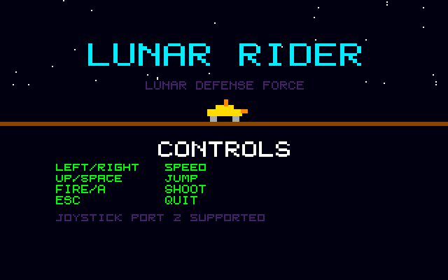
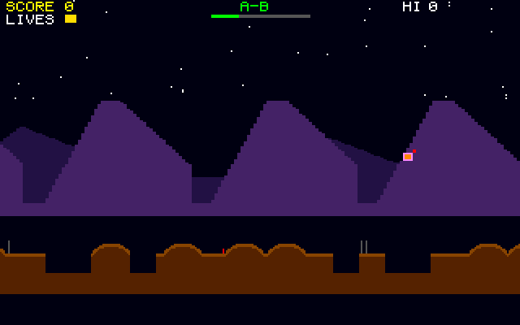

# Lunar Rider: Atari STE port

Port of Lunar Rider, the Moon Patrol-style buggy game in
[geekychris/amiga_games](https://github.com/geekychris/amiga_games) (`lunar_rider/`,
commit in `.upstream-commit`), built on the shared ST layer in `../st_port`.

## Screenshots

<table><tr>
<td align="center"><br>Title</td>
<td align="center"><br>Parallax mountains and craters</td>
<td align="center"><br>Past checkpoint B</td>
</tr></table>

Captured through the agent API (`/screen`, 2x).

```sh
make CROSS=~/computers/atari-cc/opt/cross-mint/bin/m68k-atari-mintelf-
make run CROSS=...      # STE, EmuTOS 1024k, autostart
```

Controls, as on the Amiga:
- Left / right (or D): slow down / speed up.
- Up, W, Space or joystick up: jump.
- A or fire: shoot (forward and up).
- Esc: quit.

## What changed

| | |
|---|---|
| `game.c`, all headers | **Unmodified.** |
| `sound.c` | Unmodified except for one `ST port:` block: the two dummy CIA reads between stopping and restarting a channel are skipped (there is no CIA at `$BFE001` on the ST; the access is a bus error). It drives the Paula registers directly, so it is built as C++ (`sound_st.cpp`) against the Paula emulation, which plays on STE DMA sound at 6258 Hz. |
| `draw.c` | Original drawing code, with `ST port:` changes listed below. |
| `main_st.c` | `main.c`'s state machine (kept as `main.c.amiga`), split into a 50 Hz logic step and a per-frame draw. |
| `st_input.c` | The same key map, from the IKBD handler and joystick 1. |

### ST port changes in `draw.c`

The Amiga version redraws the whole screen every frame, including two mountain silhouettes and the terrain as one `RectFill` per pixel column, about 1300 calls. The port uses the STE blitter for the scrolling layers:
- **Mountains:** both layers are pre-rendered once, from the original formulas, into 960-pixel strips, one per pairing of the 2-pixel columns. Each frame the blitter copies the far window and ORs the near one on top. Near colour 3 contains far colour 2's bits, so the OR gives the original near-over-far picture.
- **Terrain:** the game's 640-column terrain ring is kept rendered in a strip, plus a 320-column copy of its start so any window is contiguous. Columns are re-rendered only when `game.c` generates new terrain, and the blitter copies the window each frame. Mine dots follow the screen x, so they are still drawn per frame.
- **HUD:** in the HUD layer, redrawn only when it changes. Strings are cached.
- **Stars:** positions computed once, not with two 32-bit modulos per star per frame.
- **Fallback:** on a machine without a blitter, the mountains and terrain are drawn with the ST layer's `gfx_vspans`, which fills a run of vertical spans in 16-column groups.

## Performance

The game runs at **about 10–11 fps on an 8 MHz STE**, with game logic at 50 Hz (up to 4 logic steps per displayed frame). The blitter copies take about a third of the frame time.

## Agent hooks

The game logs `LUNAR SYMBOL ...` lines with addresses for `gs`, `buggy`, `state`, `score` and `frame_sync`. It also logs `LUNAR STATE`, `LUNAR SCORE` and `LUNAR PERF` events.
