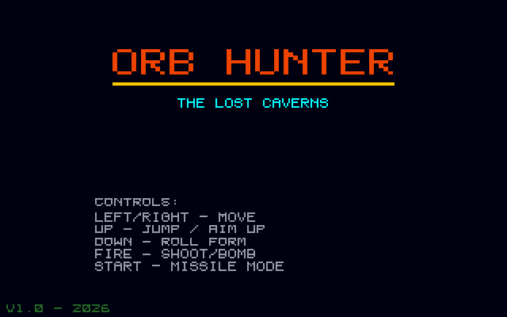
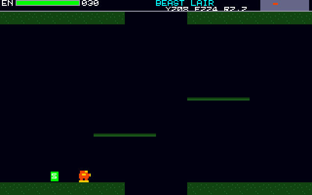
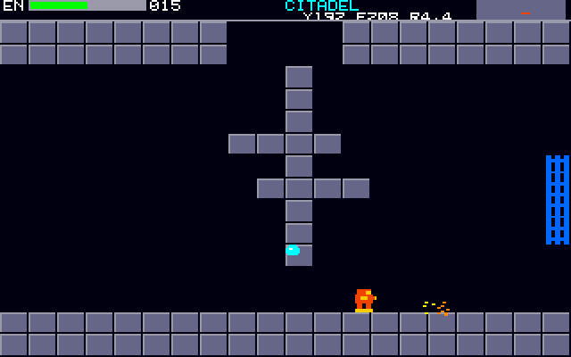

# Orb Hunter: Atari STE port

Port of Orb Hunter, the Metroid-style exploration platformer in
[geekychris/amiga_games](https://github.com/geekychris/amiga_games) (`orb_hunter/`,
commit in `.upstream-commit`), built on the shared ST layer in `../st_port`.

## Screenshots

<table><tr>
<td align="center"><br>Title</td>
<td align="center"><br>The first room, with a save point</td>
<td align="center"><br>Citadel</td>
</tr></table>

Captured through the agent API (`/screen`, 2x).

```sh
make CROSS=~/computers/atari-cc/opt/cross-mint/bin/m68k-atari-mintelf-
make run CROSS=...      # STE, EmuTOS 1024k, autostart
```

Controls, as on the Amiga:
- Cursor keys, WASD or joystick: move.
- Up: jump / aim up.
- Down (or Z): roll form.
- Space, Alt or fire: shoot (or drop a bomb when rolled).
- Return: start.
- Esc: quit.

## Music

The Amiga version plays `axelf.mod`, a cover of a commercial track, so it is **not included**. Copy any 4-channel ProTracker module to `build/AXELF.MOD`; the original loader validates and plays it. Without it, the game plays its sound effects only.

## What changed

| | |
|---|---|
| `game.c`, `levels.c`, `game.h`, `input.h` | **Unmodified.** |
| `main_st.c` | Replaces `main.c` (kept as `main.c.amiga`). The procedural sound effects, the MOD loading and validation, and the state machine are copied from it. Effects and music play on the C ptplayer (`../st_port/ptplayer`) on the Paula emulation, at 6258 Hz on the STE's DMA sound. Game logic runs once per 50 Hz VBL, as on the Amiga, and the drawing once per frame. The bridge hooks are left out; `/mem` covers them. |
| `draw.c` | `ST port:` blocks, listed below. |
| `st_input.c` | The same keys from the IKBD handler, plus joystick 1. |

### ST port changes in `draw.c`

The Amiga version clears the screen and redraws the whole room, all 320 tiles, every frame. The port instead:
- **Rooms:** the static tiles are the ST layer's scenery, redrawn only when the room changes or one of its tiles does (a door opening, an item block taken). That's checked against a copy of the room.
- **Every frame:** the animated tiles (lava, item blocks, save points) are listed once per room. They and the actors go into the back buffer and are undone through dirty rectangles.
- **HUD and boxes:** the HUD and the item box are on the HUD layer; the title and game-over pages too. Strings there are cached operations.
- **Text:** a scale-1 character is drawn as one 16-pixel masked write per row instead of a `WritePixel` per pixel.

## Performance

**16–25 fps on an 8 MHz STE**, with game logic at 50 Hz. The first rooms run at 25 fps. A good part of a busy frame is the original HUD's debug line (`Y.. F.. R..`), which changes as the hunter moves, so it is re-rendered every frame.

## Agent hooks

The game logs `ORBH SYMBOL ...` lines with addresses for `gs`, `hunter`, `room_x`, `state` and `frame_sync`. It also logs `ORBH STATE` events with the room and health, and `ORBH PERF`. The Amiga version's bridge hooks (give items, full health) are writes to `gs.hunter` through `/mem`.
