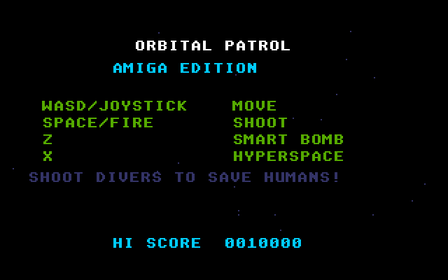
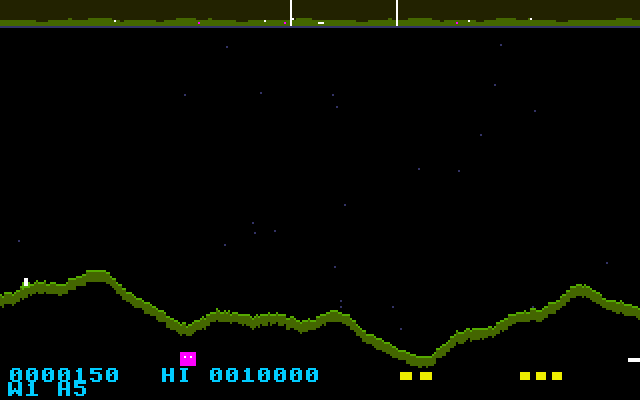

# Orbital Patrol: Atari STE port

Port of Orbital Patrol, the Defender-style shooter in
[geekychris/amiga_games](https://github.com/geekychris/amiga_games) (`orbital_patrol/`,
commit in `.upstream-commit`), built on the shared ST layer in `../st_port`.

## Screenshots

<table><tr>
<td align="center"><br>Title</td>
<td align="center"><br>Scanner, terrain, humans and enemies</td>
<td align="center"><br>Combat</td>
</tr></table>

Captured through the agent API (`/screen`, 2x).

```sh
make CROSS=~/computers/atari-cc/opt/cross-mint/bin/m68k-atari-mintelf-
make run CROSS=...                 # STE (copies the MOD into build/ as ORBITAL_.MOD)
make run MACHINE=megaste CROSS=... # Mega STE: the game switches it to 16 MHz + cache
```

Controls, as on the Amiga:
- Cursor keys, WASD or joystick: fly.
- Space, Alt, Shift or fire: shoot.
- Z: smart bomb.
- H or X: hyperspace.
- Return or Space: start.
- Esc: quit.

## What changed

| | |
|---|---|
| `game.c`, `sound.c`, `score.c`, all headers except one line of `game.h` | **Unmodified.** `game.h` declares the Amiga libnix `sprintf`, which returns `char *`; under `__MINT__` it includes `<stdio.h>` instead. |
| `sound.c` | Runs unchanged on the C ptplayer (`../st_port/ptplayer`) on the Paula emulation, so **the original MOD music plays** on the STE's DMA sound (mixed at 6258 Hz), along with the procedural sound effects. It loads the MOD and the high-score table through the AmigaDOS shim (`../st_port/amiga_dos.c`): `PROGDIR:orbital_patrol.scores` becomes `ORBITAL_.SCO`. |
| `draw.c` | Original drawing code, with `ST port:` changes listed below. |
| `main_st.c` | `main.c`'s state machine (kept as `main.c.amiga`), split into a 50 Hz logic step and a per-frame draw, so the game keeps the Amiga's speed when a frame takes several VBLs. |
| `st_input.c` | The same key map and edge-triggered bomb and hyperspace, from the IKBD handler and joystick 1. |

### ST port changes in `draw.c`

The Amiga version clears the screen and redraws everything each frame, which an 8 MHz 68000 can't do. The port layers the screen instead:
- **HUD:** in the HUD layer, redrawn only when it changes.
- **Scanner:** its background and terrain go in the scenery buffer once per terrain. The viewport brackets and blips are still drawn every frame.
- **Terrain:** the band is cleared with movem fills, then drawn from a world heightmap prepared once per wave. The ST layer's `gfx_heightmap` writes 16 columns at a time with an assembly inner loop, instead of one `RectFill` per height change.
- **Stars:** drawn after the terrain, skipping pixels it covers, which gives the same picture as the original's stars-then-terrain order. No 32-bit modulo per star.
- **Entities:** undone through dirty rectangles.

## Performance

The game runs at **about 10 fps on an 8 MHz STE**, and the game itself runs at full speed (up to 6 logic steps per displayed frame). On a **Mega STE** it runs at 17–25 fps.

The four-channel MOD mixing alone takes about 19% of an 8 MHz 68000. Everything above was measured and tuned with the agent API's profiler.

## Agent hooks

The game logs `OPATROL SYMBOL ...` lines with addresses for `gs`, `ship`, `state`, `score`, `lives`, `enemies`, `humans` and `frame_sync`. It also logs `OPATROL STATE`, `OPATROL SCORE` and `OPATROL PERF` events.
