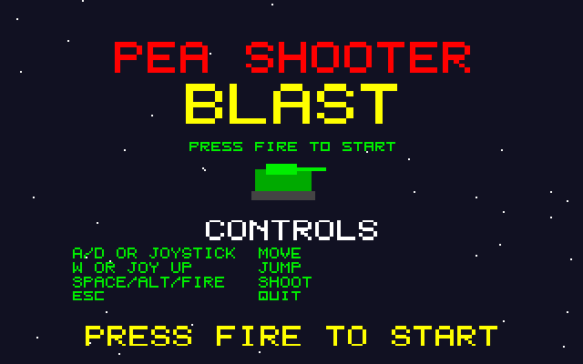
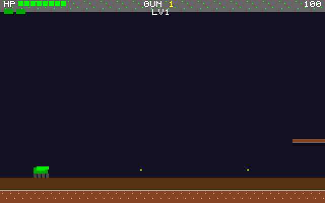

# Pea Shooter Blast: Atari STE port

Port of Pea Shooter Blast, the side-scrolling tank game in
[geekychris/amiga_games](https://github.com/geekychris/amiga_games) (`pea_shooter_blast/`,
commit in `.upstream-commit`), built on the shared ST layer in `../st_port`.

## Screenshots

<table><tr>
<td align="center"><br>Title</td>
<td align="center"><br>Level 1</td>
<td align="center"><br>Enemies and a health powerup</td>
</tr></table>

Captured through the agent API (`/screen`, 2x).

```sh
make CROSS=~/computers/atari-cc/opt/cross-mint/bin/m68k-atari-mintelf-
make run CROSS=...      # STE, EmuTOS 1024k, autostart
```

Controls, as on the Amiga:
- A/D, cursor keys or joystick: move.
- W, up or joystick up: jump.
- Space, Alt or fire: shoot (one shot per press).
- Esc: quit.

## Music

The Amiga version plays `music.mod`, a cover of a commercial game's soundtrack, so it is **not included** here. Copy any 4-channel ProTracker module to `build/MUSIC.MOD`, and the port validates and plays it as the original does, on the C ptplayer (`../st_port/ptplayer`), with the sound effects on the other channels. Without it, the game plays its sound effects only.

## What changed

| | |
|---|---|
| `game.c`, `levels.c`, `game.h`, `input.h` | **Unmodified.** |
| `main_st.c` | Replaces `main.c` (kept as `main.c.amiga`). The procedural sound effects, the MOD loading and validation, and the per-frame drawing calls are copied from it. The loop runs the game logic once per 50 Hz VBL and draws once per frame. The bridge hooks are left out; the agent API's `/mem` covers them. |
| `st_input.c` | The same key map, from the IKBD handler and joystick 1. |
| `draw.c` | Original drawing code, with `ST port:` changes listed below. |

### ST port changes in `draw.c`

The Amiga version clears and redraws all 22×16 tiles every frame, which an 8 MHz 68000 can't do at a playable rate:
- **Tiles:** when a level loads, the original `draw_tile_column` renders the whole 128-tile map into a 2048-pixel strip (200 KB). Each frame, the STE blitter copies the visible window, at any pixel offset, but only for map rows that have a tile in view. Empty rows are cleared with `movem` fills, which are several times faster than a blit.
- **HUD:** the original `draw_hud` renders into a small buffer only when health, score, lives, gun or level changes. Each frame it is masked over the tiles, touching only the 16-pixel groups it covers.
- **Text:** scale 1 characters are pre-rendered sprites, one per character, colour and y. Larger text (title, game over) uses the ST layer's string cache.
- **Fallback:** on a machine without a blitter, the original tile drawing is used.

## Performance

The game runs at **17–25 fps on an 8 MHz STE while scrolling**, with game logic at 50 Hz (up to 4 logic steps per displayed frame).

## Agent hooks

The game logs `PEASHOOT SYMBOL ...` lines with addresses for `gs`, `tank`, `scroll`, `state`, `level` and `frame_sync`. It also logs `PEASHOOT STATE`, `PEASHOOT SCORE` and `PEASHOOT PERF` events. The Amiga version's bridge hooks (heal, max weapon, extra life) are writes to `gs` through `/mem`: for example, `tank.health` is the `WORD` at `tank` + 22 (`MAX_HEALTH` is 8).
