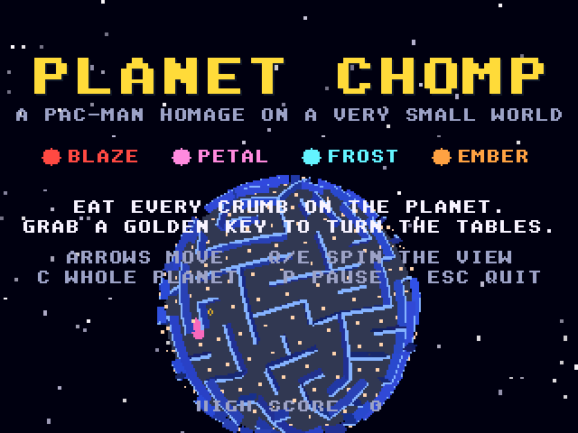
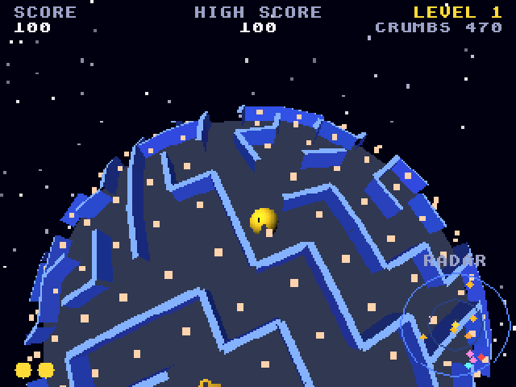

# Planet Chomp: Atari Falcon030 (CT60) port

Port of Planet Chomp from
[geekychris/amiga_games](https://github.com/geekychris/amiga_games) (`planet_chomp/`,
commit in `.upstream-commit`). It's a Pac-Man homage on a tiny planet: the maze wraps
round a sphere. Eat every crumb, dodge the four spooks, and grab a golden key to turn the tables.
It runs on the Falcon layer in [../falcon_3do](../falcon_3do).

**It needs an accelerated Falcon.** The 3DO renderer's quads and scaled
sprites are drawn in software (`softcel.c`), sized for an Amiga 68060. A stock
16 MHz Falcon030 manages about 1 fps. On an emulated CT60-style Falcon
(68060 at 32 MHz with TT-RAM) it runs at about 9 fps.

## Screenshots

<table><tr>
<td align="center"><br>Title</td>
<td align="center"><br>Level 1</td>
</tr></table>

Captured through the agent API (`/screen`, 2x).

```sh
make CROSS=~/computers/atari-cc/opt/cross-mint/bin/m68k-atari-mintelf-
make run CROSS=... HATARI_OPTS="--cpulevel 6 --cpuclock 32 --addr24 off --ttram 64"
```

Controls, as on the Amiga:
- Cursor keys, WASD, keypad 8/4/6/2 or joystick 1: steer, relative to the screen.
  A turn waits for the next junction.
- Q/E (or Z/X): spin the view. C: whole-planet view.
- P: pause. Space or Return: start. Esc: quit.
- The attract mode starts by itself after 15 s on the title.

## What changed

| | |
|---|---|
| everything except `softcel.c` | **Unmodified**, including `main_68k.c` (on `../falcon_3do`). |
| `softcel.c` | As in `../rolling_steel` (upstream's two copies are identical): the depth-buffer clear uses `movem` on a 68020 or later under `__MINT__`. |

The game draws 320×256. `sys3do.c` converts it to RGB565 and drops every
sixteenth row for the 240-line VGA screen. The sound effects are synthesised
by the game, so there's no `data/`.

## The half-drawn sky

The first build drew the starfield over only the top half of the screen. The title's
text showed through below it, and the sprites were the wrong size. The code
was right: GCC 14.3 without a frame pointer read a 64-bit division's
numerator from the wrong stack slot (see [../falcon_3do](../falcon_3do)).
The layer now builds with `-fno-omit-frame-pointer`.

## Agent hooks

The bridge client logs as `PLANET`. Every 5 s, `PLANET I fps=... walls=... cels=... ms/frame ...`.
