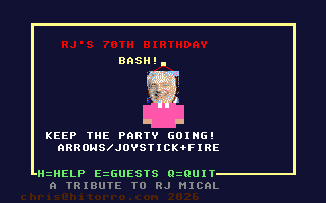
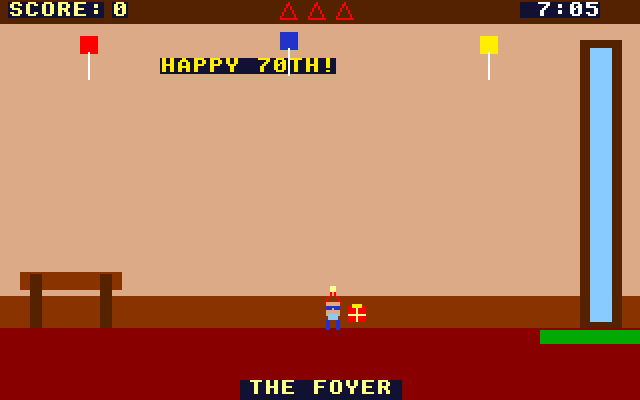
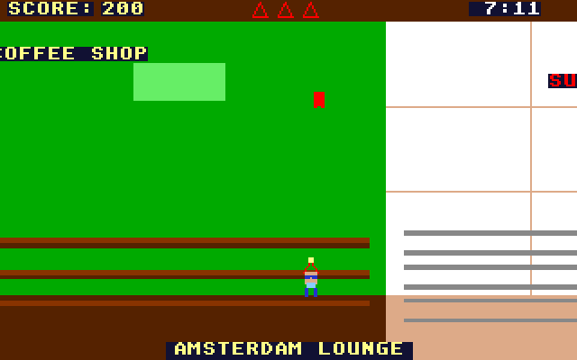

# RJ's 70th Birthday Bash: Atari STE port

Port of RJ's 70th Birthday Bash, the party arcade game in
[geekychris/amiga_games](https://github.com/geekychris/amiga_games) (`rj_birthday/`,
commit in `.upstream-commit`). It's a tribute to RJ Mical, creator of Intuition, the Amiga, the Atari Lynx and the 3DO. You run the party across six themed rooms of RJ's house: keep the guests happy, catch gifts, serve brownies and sushi, and dodge trouble. Built on the shared ST layer in `../st_port`.

## Screenshots

<table><tr>
<td align="center"><br>Title</td>
<td align="center"><br>The foyer</td>
<td align="center"><br>Scrolling into the Amsterdam lounge</td>
</tr></table>

Captured through the agent API (`/screen`, 2x).

```sh
make CROSS=~/computers/atari-cc/opt/cross-mint/bin/m68k-atari-mintelf-
make run CROSS=...      # STE, 2 MB, EmuTOS 1024k (copies GUESTS.TXT into build/)
```

Controls, as on the Amiga:
- Cursor keys or joystick: move.
- Space, Alt or fire: act.
- On the title: H for help, E for the guest list, Q to quit.
- Esc leaves the party (to the credits).
- When typing names: letters, Return, Backspace, Delete.

## Music and voice clips

The original's music (`party.mod`, `birthday.mod`) and its four arcade-cabinet voice clips are **not included**: they are third-party tracker modules and samples of unknown licence. The game runs without them, with its synthesized sound effects. For personal use, copy them from an amiga_games checkout:

```sh
make assets UPSTREAM=path/to/amiga_games   # -> build/PARTY.MOD, BIRTHDAY.MOD, SND_ARC1..4.RAW
```

## What changed

| | |
|---|---|
| `game.c`, `rooms.c`, `game.h`, `rj_sprite.h`, `guests.txt` | **Unmodified.** The guest list and high scores load and save through the AmigaDOS shim, as `GUESTS.TXT` and `HISCORES.DAT` next to the program. |
| `sound.c` | `ST port:` blocks: `CUSTOM_BASE` points ptplayer at the Paula emulation, and the voice clips get distinct 8.3 names. `snd_arcade1..4.raw` would all shorten to `SND_ARCA.RAW`. |
| `draw.c` | One `ST port:` block: the RJ head, drawn as hundreds of `RectFill` runs, is one cached operation on the HUD layer. |
| `main_st.c` | `main.c`'s loop (kept as `main.c.amiga`), with game logic once per 50 Hz VBL and the drawing once per frame. The music switching between the party and birthday modules is copied verbatim. |
| `st_input.c` | The same keys and joystick 1 from the IKBD handler. Typed characters use the same US mapping as the Amiga version, through a new `ikbd_last_hit()` in `../st_port/st_ikbd`. |

### Rendering

- **The house:** six 320-pixel rooms drawn by `rooms_draw_bg`, which depends only on the camera. They are rendered once into a 1920-pixel strip (192 KB), and the STE blitter copies the window at the camera position each frame. Guests, items, the player, the HUD and messages are drawn over it.
- **Pages:** title, help, high scores, credits, name entry, guest list and jail are on the HUD layer, which renders only what changed.

## Performance

**About 13–18 fps on an 8 MHz STE** in the party, with game logic at 50 Hz. Mixing the MOD music takes about 30% of the CPU when it's present, the blit about 15%.

## Agent hooks

The game logs `RJBB SYMBOL ...` lines with addresses for `gs`, `state`, `camera_x` and `frame_sync`. It also logs `RJBB STATE` (with room, lives, happiness), `RJBB SCORE` and `RJBB PERF` events. For scripted play, hold keys with `/input/key?action=down` / `up`.
