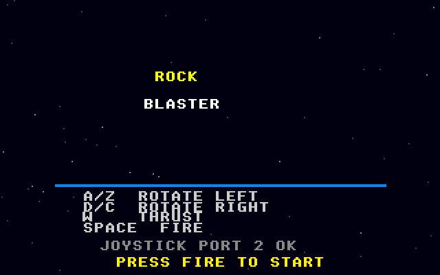

# Rock Blaster: Atari STE port

Port of Rock Blaster, the vector rock shooter in
[geekychris/amiga_games](https://github.com/geekychris/amiga_games) (`rock_blaster/`,
commit in `.upstream-commit`), built on the shared ST layer in `../st_port`.

## Screenshots

<table><tr>
<td align="center"><br>Title</td>
<td align="center"><br>Rocks, ship and HUD</td>
</tr></table>

Captured through the agent API (`/screen`, 2x).

```sh
make CROSS=~/computers/atari-cc/opt/cross-mint/bin/m68k-atari-mintelf-
make run CROSS=...      # STE, EmuTOS 1024k, build/ as C:, autostart
```

Controls, the same as on the Amiga:
- Cursor keys, A/Z, D/C or joystick: rotate.
- Up, W or joystick up: thrust.
- Space, Alt or fire: shoot.
- Esc: quit.

## What changed

| | |
|---|---|
| `game.c`, `game.h`, `draw.h`, `input.h` | **Unmodified.** |
| `draw.c` | Unmodified, except one `__MINT__` block: rocks never rotate, so each (size, shape) outline is drawn once by the original polygon code into a pre-shifted sprite, which is then blitted. A rock costs about a third of its 8 short lines on a 68000. |
| `main_st.c` | Replaces the AmigaOS parts of `main.c` (kept as `main.c.amiga`): screens, IDCMP and the bridge. The palette and the procedural sound effects are copied from it verbatim. |
| `st_input.c` | The same key map from the IKBD handler, plus joystick 1. |

### Layers

- The title page is scenery.
- Score, lives and the game-over text are in the HUD layer, redrawn only when they change.
- Rocks, ship, bullets and particles are sprites, undone through dirty rectangles each frame.
- The vector objects are drawn in the layer's OR mode, which is correct over the black playfield.

### Sound

The sound effects play through the C ptplayer on the Paula emulation, so on STE DMA sound. A plain ST has no DMA sound, so the port is silent there.

The Amiga game also loads `axelf.mod` for music. That file is not a valid ProTracker module (it has no `M.K.` tag), so the original's own validation rejects it and the game plays effects only. The port does the same and doesn't ship the file.

## Performance

The game runs at **25 fps** on an 8 MHz STE, with game updates at the Amiga's 50 Hz. Getting there took:
- the sprite cache for rocks;
- line drawing that steps along the line instead of recomputing each pixel's address, with a loop specialised per colour;
- OR mode for lines;
- merged dirty rectangles.

These were found with the agent API's profiler (`profile on`, `hatari_profile.py`).

## Agent hooks

At start-up the game logs `ROCK SYMBOL ...` lines with addresses for `gs`, `ship`, `rocks`, `state`, `score`, `tune` (the original's tunables) and `frame_sync`. It also logs `ROCK STATE`, `ROCK SCORE` and `ROCK PERF` events (NatFeats → `/console`).
