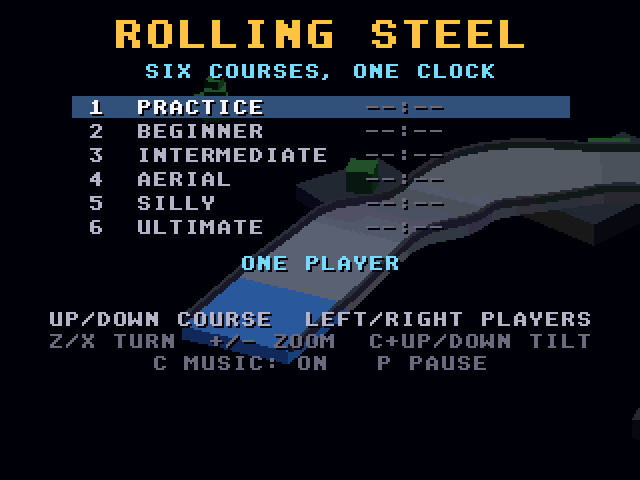
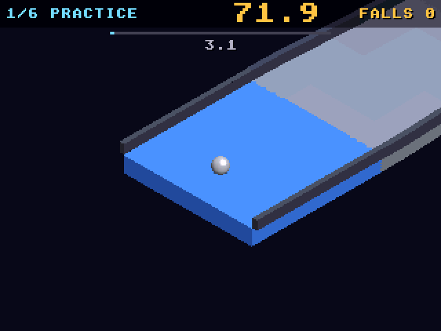

# Rolling Steel: Atari Falcon030 (CT60) port

Port of Rolling Steel from
[geekychris/amiga_games](https://github.com/geekychris/amiga_games) (`rolling_steel/`,
commit in `.upstream-commit`; MIT, see `LICENSE.original`). It's an isometric
roll-a-marble-downhill game in the spirit of the 1984 Atari cabinet: six floating courses
and one clock. It runs on the Falcon layer in [../falcon_3do](../falcon_3do).

**It needs an accelerated Falcon.** The 3D is rasterised in software with a
depth buffer (`softcel.c`), sized for an Amiga 68060. A stock 16 MHz Falcon030
manages 1–2 fps. On an emulated CT60-style Falcon (68060 at 32 MHz with
TT-RAM) it runs at 10–15 fps.

## Screenshots

<table><tr>
<td align="center"><br>Title (demo behind)</td>
<td align="center"><br>Practice course</td>
</tr></table>

Captured through the agent API (`/screen`, 2x).

```sh
make CROSS=~/computers/atari-cc/opt/cross-mint/bin/m68k-atari-mintelf-
make run CROSS=... HATARI_OPTS="--cpulevel 6 --cpuclock 32 --addr24 off --ttram 64"
```

Controls, as on the Amiga:
- Cursor keys, keypad 8/4/6/2 or joystick 1: push the marble (up is away from you).
- Z/X: turn the view. =/- or keypad +/-: zoom. C with up/down: tilt.
- F (or F10): 3D at half resolution, for speed (see below).
- P: pause. Esc: quit.
- On the title: up/down picks the starting course, left/right picks one or two players
  (player 2 uses WASD, Q/E and Tab), C turns the music on or off, and Space starts.

## What changed

| | |
|---|---|
| everything except `softcel.c` | **Unmodified**, including `main_68k.c` (on `../falcon_3do`). |
| `softcel.c` | The depth-buffer clear uses `movem` (32 bytes per instruction) on a 68020 or later under `__MINT__`. |
| `glcels_soft.c` | Half resolution (under `__MINT__`): the 3D is drawn into a 160×120 buffer, with positions halved on the way to `softcel.c`, and doubled into the frame before the HUD text goes on at full resolution. |
| `amiga68k.h` | Declares `sys_halfres` and `sys_cpu`. |
| `data/` | The six courses, music themes and effects built by the 3DO version's tools (unchanged from upstream). |

The frame is 320×240 15-bit RGB, converted to RGB565 by `sys3do.c`.

## Half resolution

F (F10 too: the keys that switch window and screen on the Amiga) draws
the 3D at 160×120, doubled, with the HUD still sharp. It starts on for a
68030 and off for a 68060 (the `_CPU` cookie).

| fps in play | full | half |
|---|---|---|
| 68060 @ 32 MHz + TT-RAM | 12 | 17 |
| stock 16 MHz Falcon030 | 1.2–1.5 | 2.0–2.3 |

A stock Falcon gains little. Filling pixels is only a fifth of the frame
there. The rest is spread over per-shape setup (64-bit edge slopes and
depth planes), the 15→16 bit conversion, physics and the HUD. The blitter
can't help, because each pixel is tested against the depth buffer and the
sprites are scaled.

## Agent hooks

The bridge client logs as `ROLL`. Every 5 s, `ROLL I fps=... ms/frame logic=... draw=... hud+blit=...`.
