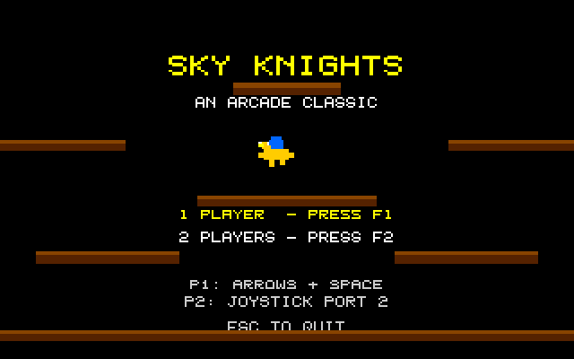
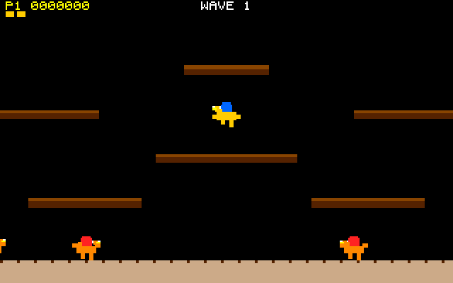

# Sky Knights: Atari STE port

Port of Sky Knights, the Joust-style aerial combat game in
[geekychris/amiga_games](https://github.com/geekychris/amiga_games) (`sky_knights/`,
commit in `.upstream-commit`), built on the shared ST layer in `../st_port`.

## Screenshots

<table><tr>
<td align="center"><br>Title</td>
<td align="center"><br>Wave 1</td>
</tr></table>

Captured through the agent API (`/screen`, 2x). The in-flight shot was set up by writing the player's position through `/mem`.

```sh
make CROSS=~/computers/atari-cc/opt/cross-mint/bin/m68k-atari-mintelf-
make run CROSS=...      # STE (copies FLAP.RAW and SMASH.RAW into build/)
```

Controls, as on the Amiga:
- **Player 1:** cursor keys or A/D move; up, W or Space flap.
- **Player 2:** joystick; up or fire flaps.
- **Starting:** F1 or 1 for one player, F2 or 2 for two.
- **Esc** quits.

Strike your opponents from above, then grab the pods they drop before they crack open.

## What changed

| | |
|---|---|
| `game.c`, `game.h`, `input.h`, `flap.raw`, `smash.raw`, `gen_sounds.py` | **Unmodified.** The samples are generated by `gen_sounds.py`. |
| `sound.c` | One `ST port:` define points it at the Paula emulation instead of `$DFF000`. It is built as C++ (`sound_st.cpp`) so its `dmacon` writes reach the emulated DMA control, and it plays on STE DMA sound at 6258 Hz. It loads `DH2:Dev/flap.raw` through the AmigaDOS shim, which looks for `FLAP.RAW` in the current directory. |
| `draw.c` | `ST port:` blocks: text becomes cached operations on the ST layer's HUD layer, and new `draw_st_*` functions split `draw_wave_intro` / `draw_playing` into layers. They use the same drawing code. |
| `main_st.c` | `main.c`'s loop body (kept as `main.c.amiga`) runs once per 50 Hz VBL, with the drawing once per frame. |
| `st_input.c` | The same keys from the IKBD handler; player 2 on joystick 1. |

### Rendering

The Amiga version clears and redraws the whole screen every frame. The port uses the ST layer's layers instead:
- **Scenery:** the ground and platforms never move, so they're drawn once per screen mode.
- **HUD layer:** the score line and the title, wave and game-over pages. It renders only what changed.
- **Back buffer:** riders and pods each frame, undone through dirty rectangles.

## Performance

**A steady 25 fps on an 8 MHz STE**, with game logic at the Amiga's 50 Hz.

## Agent hooks

The game logs `SKYK SYMBOL ...` lines with addresses for `gs`, `players`, `enemies`, `state`, `score` and `frame_sync`. It also logs `SKYK STATE`, `SKYK SCORE` and `SKYK PERF` events. A player starts with `x`, `y`, `dx`, `dy`: four 16.16 fixed-point `LONG`s.
