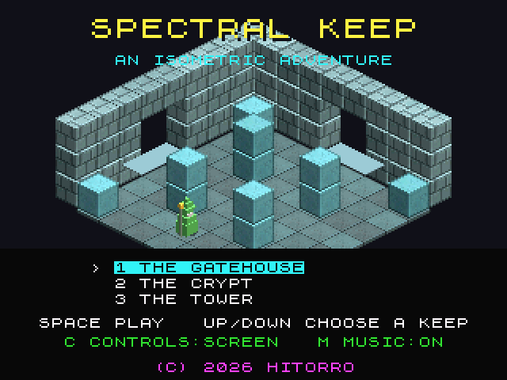
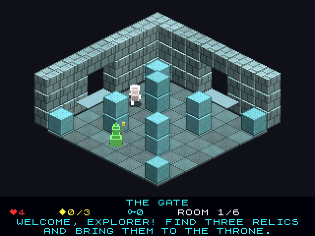

# Spectral Keep: Atari Falcon030 port

Port of Spectral Keep, an isometric flip-screen adventure in the style of Knight Lore,
from [geekychris/amiga_games](https://github.com/geekychris/amiga_games)
(`spectral_keep/`, commit in `.upstream-commit`). There are three keeps and 24 rooms.
Find the relics and carry them to the throne. Keys open the red gates, potions are
extra lives, and guards, hounds, ghosts, bouncers and spikes are deadly.
It runs on the Falcon layer in [../falcon_3do](../falcon_3do).

## Screenshots

<table><tr>
<td align="center"><br>Title</td>
<td align="center"><br>The Gatehouse</td>
</tr></table>

Captured through the agent API (`/screen`, 2x).

```sh
make CROSS=~/computers/atari-cc/opt/cross-mint/bin/m68k-atari-mintelf-
make run CROSS=...      # Falcon030, 14 MB, VGA; data/ is copied to build/DATA
```

Controls, as on the Amiga:
- Cursor keys, WASD, keypad 8/4/6/2 or joystick 1: walk, relative to the screen.
- Space, Return or fire: jump.
- P: pause. Esc: quit.
- On the title: up/down picks a keep, C switches to grid directions,
  M turns music on or off, and Space starts. Q and E together start a tour of every room.

## What changed

| | |
|---|---|
| `game.c`, `room.c`, `world.c`, `levels.c`, `vox.c`, `font.c`, `textures.c`, `sound_paula.c`, `keep.h` | **Unmodified.** |
| `scene.c` | The room compositor gets a `SCENE_RGB565` pixel format (Falcon true colour), so the game composes straight into the screen with no conversion pass. The room background is restored only where sprites, text and the panel were drawn: each of the three screen buffers keeps its own dirty rectangles, copied with `movem`. The HUD panel's half-shade uses a 64K lookup table. |
| `main_68k.c` | Under `__MINT__`: asks for `sys_rgb565`, converts its pens to RGB565, points the scene at the moving back buffer each frame, and marks the HUD's rectangles. |
| `amiga68k.h` | Declares `sys_rgb565`. |
| `data/` | Music and effects rendered by the 3DO version's own tools (unchanged from upstream). |

## Performance

About 11 fps in play on a stock 16 MHz Falcon030, and about 6 fps on the
title, which redraws the whole room. Before the changes to `scene.c`, play
ran at 4.7 fps. The time went on the 15→16 bit conversion, copying the full
background every frame, and the panel shade.

## Agent hooks

The bridge client logs as `KEEP`. State changes, rooms, and every few seconds
`KEEP I fps=... cels=... ms/frame logic=... draw=...`.
