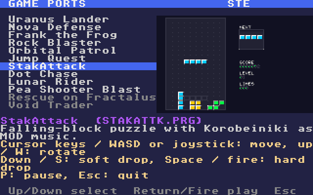

# ST game launcher

A menu that runs on the Atari itself. Every game port goes on one C: drive, and `LAUNCHER.PRG` lets you pick a game and play it. When you quit the game, you're back in the menu.



```sh
make CROSS=~/computers/atari-cc/opt/cross-mint/bin/m68k-atari-mintelf-
make play          # build every game, assemble build/drive, boot it on an STE
python3 make_drive.py --no-build --run                    # reuse the built games
python3 make_drive.py --no-build --run --machine falcon   # start on the Falcon030 instead
```

## Switching between the STE and the Falcon030

With `--run`, `make_drive.py` keeps running after it starts Hatari, as a supervisor. To change machines:
- **Pick a game for the other machine** and press Return or fire. For example, Void Trader on the STE: Hatari reboots as a Falcon030 and the game starts right away.
- **Press M** in the menu to switch without picking a game.

Quitting the game brings you back to the menu on the new machine.

Behind the scenes:
1. The supervisor creates `C:\SWITCH.ON`, which tells the launcher that switching is available.
2. The launcher writes the chosen game to `C:\LAUNCHER.NXT` and logs `LAUNCHER SWITCH falcon` (or `ste`).
3. The supervisor sees that line on the agent API's `/console`, and posts the machine's options to `/config`: `--machine falcon --memsize 14 --monitor vga`, or `--machine ste --memsize 4 --monitor rgb`.
4. Hatari cold-boots the same drive, and the launcher starts the game in `LAUNCHER.NXT`.

Ctrl-C stops the supervisor and leaves Hatari running. `--no-watch` starts Hatari without a supervisor; the launcher then only tells you which machine a game needs. You can also switch by hand through the agent API at any time; the launcher autostarts after the reboot:

```sh
curl -s -XPOST localhost:7777/config --data-urlencode "args=--machine falcon --memsize 14 --monitor vga --dsp none"
curl -s -XPOST localhost:7777/config --data-urlencode "args=--machine ste --memsize 4 --monitor rgb --dsp none"
```

## The drive

`make_drive.py` reads [`examples/games.ini`](../games.ini), the same file the [host launcher](../../tools/games) uses, and writes `build/drive`:

```
LAUNCHER.PRG                 the menu (autostarted by --run)
GAMES.INI                    the game list, in the launcher's format
GAMES\STAKATTK\STAKATTK.PRG  each game's build/ files: program and data (MODs, scores)
GAMES\STAKATTK\THUMB.DAT     160x100 thumbnail made from the game's screenshot
```

Copy `build/drive` to a real machine's hard disk partition, or to a GEMDOS drive in an emulator, and run `LAUNCHER.PRG`.

With `--run`, Hatari starts on the drive with EmuTOS 1024k:
- Default: an STE with 4 MB.
- `--machine falcon`: a Falcon030, 14 MB, VGA.

## The menu

- **Up/Down** or the joystick select a game, and **Return**, **Space** or **fire** start it. **M** switches machines (above), and **Esc** quits to the desktop.
- **Text** goes through the TOS VT52 console in ST low resolution, and descriptions and controls are wrapped to 40 columns.
- **Thumbnails** go straight to screen memory. Each one uses pens 8–15 with 8 colours taken from the game's own palette: the most frequent first, then greedily by frequency × distance, which keeps small bright sprites and text.
- **The machine** is detected from the `_MCH` cookie. Games it can't run are greyed out and say what they need: on an STE, the two Falcon games; on a Falcon, the ST and STE games; on a plain ST, the STE games.
- **Starting a game:** the launcher hides its menu, frees its IKBD handler, sets the current directory to the game's folder (so the game finds its data files) and runs it with `Pexec`. When the game exits, the menu comes back on the same entry.
- **Logging:** with NatFeats on, `LAUNCHER START/PLAY/BACK/EXIT` lines go to the agent API's `/console`.

## Tested

On an STE: Lunar Rider, Pea Shooter Blast, Uranus Lander (a plain-ST game), Jump Quest and Dot Chase, played one after another in one session. Each started from its folder and came back to the menu with exit code 0. On a Falcon030: Void Trader started and returned the same way. Switching: on the STE, Return on Void Trader rebooted Hatari as a Falcon030 and started the game; after Esc, M went back to the STE.
