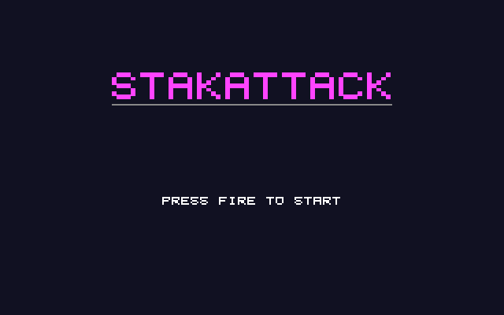

# StakAttack: Atari STE port

Port of StakAttack, the falling-block game in
[geekychris/amiga_games](https://github.com/geekychris/amiga_games) (`stakattack/`,
commit in `.upstream-commit`), built on the shared ST layer in `../st_port`.

## Screenshots

<table><tr>
<td align="center"><br>Title</td>
<td align="center"><br>Play</td>
</tr></table>

Captured through the agent API (`/screen`, 2x).

```sh
make CROSS=~/computers/atari-cc/opt/cross-mint/bin/m68k-atari-mintelf-
make run CROSS=...      # STE (copies the MOD into build/ as STAKATTA.MOD)
```

Controls, as on the Amiga:
- Cursor keys, WASD or joystick: move.
- Up or W: rotate.
- Down or S: soft drop.
- Space or fire: hard drop (start, on the title).
- Alt or Return: start.
- P: pause.
- Esc: quit.

## What changed

| | |
|---|---|
| `game.c`, headers, `stakattack.mod`, `generate_mod.py` | **Unmodified.** The MOD is Korobeiniki (a traditional melody, public domain), generated by `generate_mod.py`. |
| `main_st.c` | Replaces `main.c` (kept as `main.c.amiga`). The sound effects and the MOD loader are copied from it verbatim. The MOD plays on the C ptplayer (`../st_port/ptplayer`) on the Paula emulation, at 6258 Hz on the STE's DMA sound. Game logic runs once per 50 Hz VBL, as in the Amiga main loop, and the drawing once per frame. |
| `draw.c` | Two `ST port:` blocks: text strings and field cells become cached operations of the ST layer, re-rendered only when they change. |
| `st_input.c` | The same key map, from the IKBD handler and joystick 1. |

### Rendering

- **Field:** the grid and the locked cells are the ST layer's scenery. They are redrawn only when the field changes, when a piece locks or lines clear.
- **Every frame:** the falling piece, its ghost, the next-piece box, the HUD and overlays go through the HUD layer, which renders only what changed.

## Performance

**15–28 fps on an 8 MHz STE**, with game logic at 50 Hz. The low end is the frame in which a piece locks and the field is rebuilt.

## Agent hooks

The game logs `STAK SYMBOL ...` lines with addresses for `gs`, `field`, `current`, `state`, `score` and `frame_sync`, plus `STAK STATE`, `STAK SCORE` and `STAK PERF` events.
