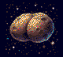

# Uranus Lander: Atari ST port

A port of Uranus Lander from the Amiga
([geekychris/amiga_games](https://github.com/geekychris/amiga_games), `uranus_lander/`,
commit in `.upstream-commit`) to the Atari ST. It was built, run, profiled
and tested entirely through the Hatari agent API.



## Build and run

```sh
../../tools/agent/fetch-cross-mint.sh      # once
make CROSS=~/computers/atari-cc/opt/cross-mint/bin/m68k-atari-mintelf-
make run CROSS=...                         # ST, PAL EmuTOS, build/ as C:, autostart
python3 autopilot.py --levels 3            # let the autopilot play it
```

Controls: cursor keys / A,D or joystick to rotate. Space / W, joystick fire
or up to thrust. M toggles music. Esc quits.

## What was ported, what changed

| Amiga | ST port |
|---|---|
| `game.c` (physics, terrain, states, scores) | **unchanged**, except high-score file I/O (AmigaDOS → stdio, `URANUS.HI` in the current directory) |
| `draw.c` (graphics.library drawing) | almost unchanged. It runs on `st_gfx.c`, which implements `SetAPen/SetBPen/Move/Draw/RectFill/WritePixel/Text` for ST low resolution. ST-only changes are marked `ST port:`: planet blit, title split into static/animated parts, batched stars, 16-bit rotate. |
| 320x256 PAL, 16 colours | 320x200, same palette (12-bit → STE colour format). The game keeps its 256-line coordinates; Y is mapped to 200 lines in the graphics layer, so gameplay is identical. |
| double-buffered `ChangeScreenBuffer` | two 32 KB screens, video base registers swapped at VBL |
| IDCMP raw keys + joystick registers | own IKBD (ACIA) interrupt handler: full make/break key state, joystick events (`st_input.c`) |
| ProTracker MOD + Paula samples | YM2149 PSG: synthesised thrust/crash/land/beep and a small chiptune loop in place of the MOD (`st_sound.c`). A plain ST has no sample playback hardware. |
| AmigaBridge variables/hooks | NatFeats log lines + symbol addresses (below). Tunables can be changed through the agent API's `/mem`. |

## Agent hooks

With `--natfeats on` the game logs to the agent API `/console`:

```
URANUS START
URANUS SYMBOL ship 0x0333a6        (also gs, g_tune, pads, terrain_y, state, score,
                                    lives, level, frame_sync, perf_flags)
URANUS STATE PLAYING level=1 score=0 lives=3
URANUS LANDED level=1 pad=2 bonus=535 score=535
URANUS CRASH level=2 score=535 lives=2
URANUS PERF frames=100 vbls=200 state=1
```

`autopilot.py` uses them to play the game in a closed loop through the API:
it reads ship position, velocity, angle and the pads from emulated RAM, then
steers with the joystick. It stops at a breakpoint on `frame_sync`
(`gfx_swap()`) every frame. Pausing at an arbitrary instruction can catch
the game halfway through an update, which happened during development. It
landed 3 of 3 levels in testing:

```
level 1: target x2 pad at x=183..212 y=229, fuel 600
   -> LANDED after 168 frames, score 535, vx=-0.05 vy=+0.07 angle=+6
...
landed 3, crashed 0
```

## Performance notes

An 8 MHz 68000 can't redraw a 32 KB screen 50 times a second from C, so
rendering is layered (`st_gfx.h`):

* **scenery** (terrain, title page) is drawn once per level into a
  background buffer.
* the **HUD** is drawn through a recording RastPort. The same `draw_hud()`
  calls run every frame, but they're diffed against the previous frame, and
  only changed items are rendered (into the background) and invalidated.
* **sprites** (stars, particles, ship) are drawn into the back buffer and
  undone next frame by restoring the dirty rectangles from the background.

These were found with the agent API: Hatari's profiler (`profile on/save` +
`tools/debugger/hatari_profile.py`), cycle-exact stage timing (breakpoints
plus the `CycleCounter` variable), and A/B tests that toggle rendering
features through the `perf_flags` variable via `/mem`. Fixes included 8x8
text and line fast paths, a mintlib `sprintf` replacement (~10k cycles per
call), a 32-bit multiply in the Y mapping, an O(n²) diff, per-star C calls
(~1500 cycles each → batched), and `Setscreen()` waiting for an extra VBL.

Result: about 280k cycles per frame. The game runs a steady **25 fps with
two 50 Hz game updates per frame**, so it plays at exactly the Amiga's speed.
Busy moments (thrust plus a changing HUD) can drop to 17 fps. Reaching 50 fps
would need the drawing primitives in assembly (the next step if wanted).
`PERF` lines report the real rate.
