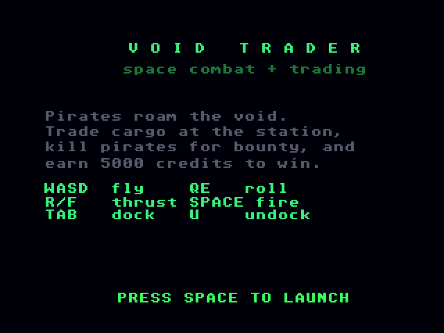
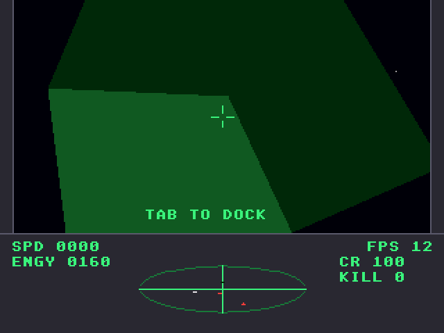
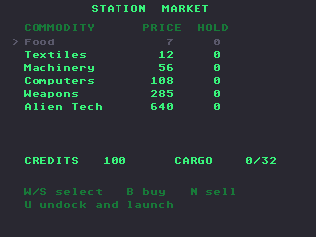

# Void Trader: Atari Falcon030 port

Port of Void Trader, the Elite-style space trading and combat game in
[geekychris/amiga_games](https://github.com/geekychris/amiga_games) (`void_trader/`,
commit in `.upstream-commit`). The Amiga version is AGA, 256 colours. The port runs on the Falcon layer in `../falcon_port` (16-bit true colour) with the Paula emulation from `../st_port`.

## Screenshots

<table><tr>
<td align="center"><br>Title</td>
<td align="center"><br>A pirate Krait in the sights</td>
</tr><tr>
<td align="center"><br>Station approach</td>
<td align="center"><br>Docked: station market</td>
</tr></table>

Captured through the agent API (`/screen`, 2x). The combat and station shots were set up by writing the camera (`cam`) through `/mem`.

```sh
make CROSS=~/computers/atari-cc/opt/cross-mint/bin/m68k-atari-mintelf-
make run CROSS=...      # Falcon030, 14 MB, VGA, EmuTOS 1024k, autostart
```

Controls, as on the Amiga:
- W/S: pitch.
- A/D: yaw.
- Q/E: roll.
- R/F: thrust up/down.
- Space: fire, start.
- Tab: dock (near the station).
- U: undock.
- In the market, W/S select, B buys and N sells.
- Esc: quit.

## What changed

| | |
|---|---|
| `engine3d.c`, `models.c`, `combat.c`, `scanner.c`, `trade.c`, `sfx.c`, `modplay.c`, all headers | **Unmodified.** |
| `modplay.c` | The game's own MOD-style player and track generator. It drives the Paula registers directly, so it is built as C++ against the Paula emulation (as in [../fractalus](../fractalus)). `audio_falcon.cpp` runs its tick from the VBL at 50 Hz. Music and effects play on the Falcon's DMA sound at 9834 Hz. |
| `main_falcon.c` | Replaces `main.c` (kept as `main.c.amiga`). The palette, cockpit, world setup, camera, per-mode game code and drawing are copied verbatim. The screen, input and loop timing are the Falcon's. |
| `../falcon_port/fgfx.c` | New `AreaMove`/`AreaDraw`/`AreaEnd`, which the 3D engine uses for its filled, shaded triangles. They fill convex polygons per scanline in 16.16 fixed point, with no `TmpRas`/`AreaInfo` setup needed. |

### Timing

On the Amiga the game advances one tick per rendered frame, capped at 50 by the display. The Falcon renders at 10–28 fps, so the port runs the game logic at a fixed **25 ticks per second** (up to 4 per displayed frame) and draws once per loop. Turn and thrust rates therefore match a 25 fps Amiga. To change this, edit `TICK_HZ` in `main_falcon.c`.

### Input

The Amiga code builds its key flags from key-down/up events. Clearing them at a mode change (`input_flags = 0`) means a held key only counts again after it is pressed again. The port polls the IKBD key state and keeps that behaviour: keys cleared by the game are held back until released.

## Performance

On a 16 MHz Falcon030 (VGA, 320×240 true colour), the title runs at about 28 fps. Flight runs at **10–16 fps**, lower when a ship or the station fills the view. Most of the frame time goes to pixel fills: clearing the view and console (about a third) and the large polygon faces (about a fifth). Both are limited by the Falcon's 16-bit ST-RAM bus.

## Agent hooks

The game logs `VTRADER SYMBOL ...` lines with addresses for `cam` (six `LONG`s: x, y, z, pitch, yaw, roll), `world` (8 entities of 32 bytes), `combat`, `trade`, `game_mode` and `frame_sync`. It also logs `VTRADER STATE`, `VTRADER SCORE` and `VTRADER PERF` events.
